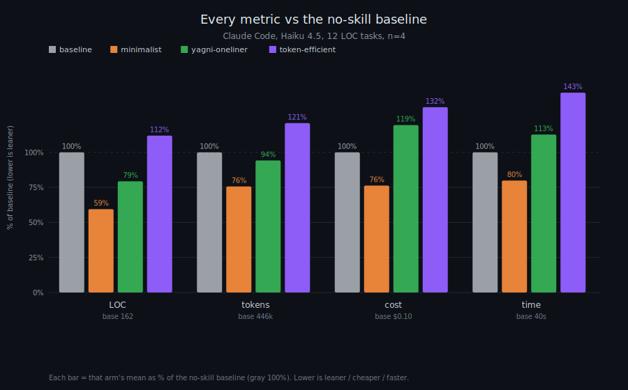

<p align="center">
  <picture>
    <source media="(prefers-color-scheme: light)" srcset="assets/minimalist_logo_light.png">
    
  </picture>
</p>


<p align="center">
  
</p>

<p align="center">
  <em>Make coding agents write less code, use fewer tokens, and skip the bloat.</em>
</p>

<p align="center">
  
  
  
  
  
  
</p>

---

**What it does:** Minimalist helps coding agents do less. It pushes them to
write smaller diffs, use fewer tokens, skip extra dependencies, and avoid
features you did not ask for. It also keeps a record of what it refused to
build, so the same bloat does not come back later.

It is minimal, but not reckless: it does not remove validation, auth, error
handling, cleanup, tests, or secret-safety checks just to save lines.

**In short:** in a real Claude Code LOC benchmark, Minimalist wrote on average about
**41% less code**, used **24% fewer tokens**, cost **24% less**, and ran
**20% faster** than no-skill baseline. All 288 LOC cells were correct.



This is a real agentic run, not a single-shot prompt: Claude Code edited a
pinned FastAPI + React template and the benchmark scored the `git diff` it
left behind.

| arm | LOC | tokens | cost | time |
|---|---:|---:|---:|---:|
| baseline | 100% | 100% | 100% | 100% |
| minimalist | 59% | 76% | 76% | 80% |
| yagni-oneliner | 79% | 94% | 119% | 113% |
| token-efficient | 112% | 121% | 132% | 143% |

Raw files:

- [`benchmarks/results/2026-07-05-agentic.md`](benchmarks/results/2026-07-05-agentic.md)
- [`benchmarks/results/2026-07-05-agentic.json`](benchmarks/results/2026-07-05-agentic.json)

It ships as two skills:

- `/minimalist` for coding tasks: less code, fewer tokens, fewer invented
  requirements, no unsafe shortcuts.
- `/minimalist-general` for writing, planning, research, and decisions: the
  same subtraction discipline without code-specific rules.

Ask your agent for a date picker. Left alone, it installs a library, writes
a wrapper component, a stylesheet, and a paragraph about timezones you
didn't ask for. With minimalist:

```html
<!-- descent step 4: the platform already has one -->
<input type="date">
```

**Minimalist** makes the agent ask simple questions before it writes code:
does this need to exist, is it already in the repo, does the language or
browser already do it, can it be one line? Only after that does it write new
code. Every rejected abstraction or dependency can be logged, so the same
scope debate does not have to happen again next week.

> [!TIP]
> **Turn it on:** it's active by default the moment the plugin's installed.
> Switch modes with `/minimalist lite|full|ultra|off`, or say "stop minimalist" /
> "normal mode" to step out any time.

> [!IMPORTANT]
> **Honest numbers, not vibes.** Minimalist never invents a savings figure.
> Every number above is a real measured run, not a guess.

## The ledger

Every time the agent skips a dependency or a piece of extra code, it logs
the decision to a file on your machine — so you can check later what it
skipped and why, instead of just trusting a line in chat:

```
$ node scripts/log-rejection.js --report
3 rejected-scope entries in ~/.minimalist/ledger.jsonl

- [platform] date picker library -> <input type="date">
- [yagni] config flag for a value that never changes
- [stdlib] custom debounce helper -> AbortController + setTimeout
```

`/minimalist-gain` reads this file back — real history, not the model's
memory of the last five minutes.

## Install

Node.js 18+ on PATH (for the two lifecycle hooks; skills work without it).

 **Claude Code**
```
/plugin marketplace add DivyeshJayswal/minimalist
/plugin install minimalist@minimalist
```
Desktop app: Customize → personal plugins → Add from repository → repo URL.

 **Codex**
```bash
codex plugin marketplace add DivyeshJayswal/minimalist
```
`/plugins` → install Minimalist → `/hooks` → trust its two hooks → new thread.

 **GitHub Copilot CLI**
```bash
copilot plugin marketplace add DivyeshJayswal/minimalist
copilot plugin install minimalist@minimalist
```
Commands are namespaced: `/minimalist:minimalist ultra`.

 **Gemini CLI**
```bash
gemini extensions install https://github.com/DivyeshJayswal/minimalist
```

 **Antigravity CLI**
```bash
agy plugin install https://github.com/DivyeshJayswal/minimalist
```
Reuses the Gemini extension; also ships `.agents/rules/` for always-on rules.

π **Pi agent harness**
```bash
pi install git:github.com/DivyeshJayswal/minimalist
```

 **OpenCode**
```json
{ "plugin": ["minimalist-skill"] }
```
Or from a checkout: `{ "plugin": ["./.opencode/plugins/minimalist.mjs"] }`.
OpenCode also auto-loads this repo's `AGENTS.md`.

☰ **Hermes**
```bash
hermes plugins install DivyeshJayswal/minimalist --enable
```

🦞 **OpenClaw**
```bash
clawhub install @divyeshjayswal/minimalist
```
The review, audit, gain, and help skills install the same way
(`clawhub install @divyeshjayswal/minimalist-review`, and so on — the `@divyeshjayswal/`
prefix disambiguates from unrelated same-named skills on the registry). Without
ClawHub, skills ship in `.openclaw/skills/`; point your skills path at the repo.

**Cursor · Windsurf · Cline · Kiro · Devin · CodeWhale · Swival** — rule files
are pre-generated, copy the one you need: `.cursor/rules/minimalist.mdc`,
`.windsurf/rules/minimalist.md`, `.clinerules/minimalist.md`,
`.kiro/steering/minimalist.md`, `.github/copilot-instructions.md`,
`.devin-plugin/`, or generic `AGENTS.md`.

## Update

Most installs point back to this repo. After a release, Git-based installs
update by pulling/reinstalling from GitHub; registry installs update from the
registry they came from.

| install type | examples | update path |
|---|---|---|
| Git-based | Gemini, Antigravity, Pi, local OpenCode, copied rule files | pull or reinstall from GitHub; copy rule files again if needed |
| Marketplace/plugin wrapper | Claude Code, Codex, Copilot CLI, Hermes | update/reinstall through that tool's plugin command |
| Registry copy | npm/OpenCode package, ClawHub/OpenClaw | publish the new package there, then update through that registry |

**Uninstall**
```bash
node scripts/uninstall.js
```

## Commands

| command | does |
|---|---|
| `/minimalist [lite\|full\|ultra\|off]` | for coding tasks — set intensity (default **full**) |
| `/minimalist-general [lite\|full\|ultra\|off]` | for everything else: writing, planning, research |
| `/minimalist-review` | review a diff for bloat — and for missing guards |
| `/minimalist-audit` | ranked deletion candidates across the codebase |
| `/minimalist-gain` | the ledger, read back — measured, never invented |
| `/minimalist-help` | the whole tool in 15 lines |

**lite** just flags over-engineering and lets you decide. **full** (the
default) actually enforces the rules. **ultra** goes further and keeps its
own explanations to almost nothing. The safety guardrail never turns off,
at any of the three. Say "stop minimalist" or "normal mode" to switch it
off entirely.

## How it works

Minimalist has one rulebook (`skills/minimalist/SKILL.md`). Every supported
tool — Claude Code, Codex, Copilot, Gemini, OpenCode, and the rest — gets its
own copy generated from that single file, so the rules stay identical
everywhere instead of drifting between nine hand-maintained versions.

Your chosen level (`lite`/`full`/`ultra`/`off`) and the rejection ledger both
persist in `~/.minimalist/`, so they carry over between sessions.

If you're also running another instruction skill (like an output-style
skill), minimalist won't fight it — it defers on prose style and keeps
enforcing code-minimalism.

## Star this repo

Costs nothing, helps someone else find the smaller version of what they were
about to build. Fair trade. ⭐

---

<p align="center"><em>Write less. Prove it. Break nothing.</em></p>
